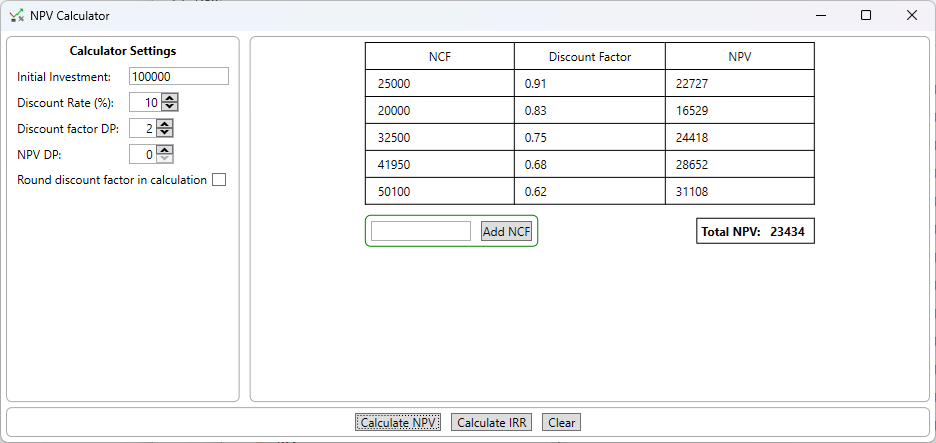

# Project Management Calculator for Net Present Value (NPV) and Internal Rate of Return (IRR)

## API Features

* Get NPV for a list of Net Cash Flow (NCF) values at given discount rate and precision
* Results show calculated discounting factor, NPVs, and total NPV
* Get IRR for a list of NCF values between specifiable minimum and maximum discount rates
* Configurable calculation settings (results precision, calculation precision, calcution rounding)

## UI Application

Simple Windows UI application that uses the API to enter calculation parameters, perform calculations, and display results.

